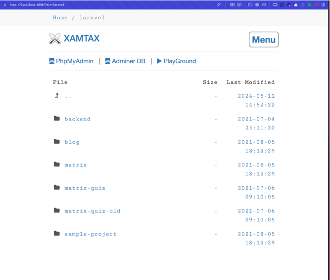
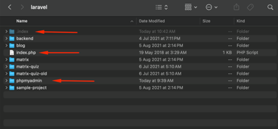

# PHP projects navigator

This helps you to navigate through your PHP projects, and also to view the structure of your project.
It includes a menu for PhpMyAdmin, and a Playground where you can test your PHP codes.

## Installation

Clone the repository and extract it in your projects root directory.

# Update menu
- You can replace the content of 'phpmyadmin' with the latest version of phpmyadmin(https://www.phpmyadmin.net/downloads/)
- To update menu, goto [/.index/themes/bootstrap/default_header.php](/.index/themes/bootstrap/default_header.php)

## Credit
- Chris Kankiewicz directorylister for the file listing feature. https://github.com/DirectoryLister/DirectoryLister

## Contribution is welcome
if you have any idea or feature you want to add, you can fork the project and create a pull request.